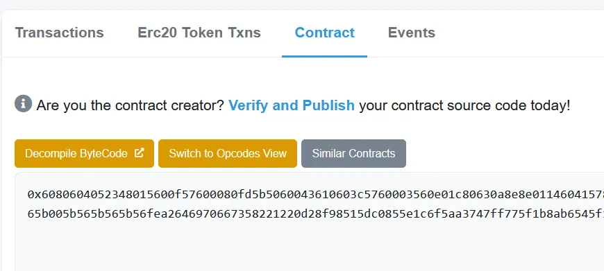

Ok so you might have noticed something by now 

Whenever we dont verify a contract on etherscan we cannot read its code.

We can only read its "Byte-code" i.e



Ok so im gonna do a pro-gamer move.
(Im gonna deploy my own contract and reverse it).
```
This is the contract im going to decompile 
// SPDX-License-Identifier: UNLICENSED
pragma solidity ^0.8.0;
contract Test {  
    
   function test() external {      } 
     
   function test2() external {      }  
    
   function test3() external {      }  
}
```

putting this in remix and debugging it we get 

[
	"0x6080604052348015600e575f80fd5b5060928061001b5f395ff3fe6080604052348015600e575f80fd5b5060043610603a575f3560e01c80630a8e8e0114603e57806366e41cb7146046578063f8a8fd6d14604e575b5f80fd5b60446056565b005b604c6058565b005b6054605a565b005b565b565b56fea264697066735822122055ff0d48126e74afbf0e70a0c08e275f07cc72ba60bdfae4d80c346371101d6464736f6c63430008160033"
]

Notice this is in assembly.
Lemme explain 

"0x60806040"

0x6080= 000 PUSH 80

so basically The instruction at byte 00 (the first byte) in the smart contract is PUSH 80 (translated to 6080in byte-code opcode).
The instruction at byte 41 is PUSH1 00(and with 1 argument which is 00) (6000 in byte-code opcode).
The instruction at byte 56 is CALLDATALOAD without arguments ( 80in byte-code opcode). I highlighted these instructions in the contract byte-code upwards.
