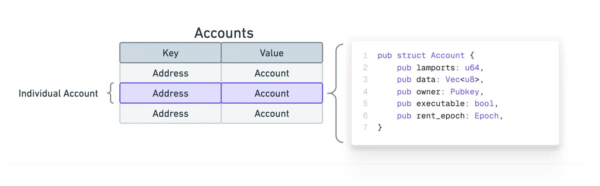

On Solana, all data is contained in what we call "accounts". You can think of data on Solana as a public database with a single "Accounts" table, where each entry in this table is an individual account with the same base Account type.

*_Key Points_*

Accounts can store up to 10MiB of data, which contain either executable program code or program state.
Accounts require a rent deposit in lamports (SOL) that is proportional to the amount of data stored, which is fully refundable when the account is closed.
Every account has a program owner. Only the program that owns an account can modify its data or deduct its lamport balance. However, anyone can increase the balance.
Programs (smart contracts) are stateless accounts that store executable code.
Data accounts are created by programs to store and manage program state.
Native programs are built-in programs included with the Solana runtime.
Sysvar accounts are special accounts that store network cluster state.

_Account_

Every account on Solana is identifiable by a unique 32 byte address, which is generally displayed as a base58 encoded string (e.g 14grJpemFaf88c8tiVb77W7TYg2W3ir6pfkKz3YjhhZ5).

The relationship between the account and its address can be thought of as a key-value pair, where the address serves as the key to locate the corresponding on-chain data of the account.